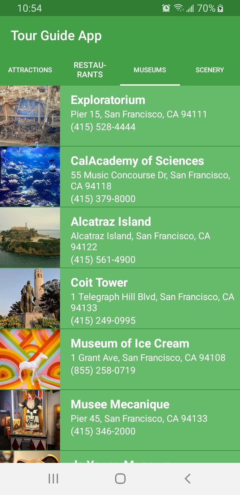

# Udacity Android Basics Nanodegree - TourGuideApp
This repository contains the TourGuideApp app from Udacity's Multi-Screen Apps course. This app is created using Android Studio and developed in Java. The layout was designed in an XML document using a combination of a RelativeLayouts, LinearLayouts, TabLayouts, ViewPagers, TextViews, and ImageViews. The user navigates between lists in Fragments using a ViewPager plus TabLayout. A custom object is used for storing location information, and a custom adapter is used to populate the layout based on instances of the custom class.

## Overview
TourGuideApp is an app that allows users to see 10 popular tourist destinations in San Francisco for each of four categories: Attractions, Restaurants, Museums, and Scenery. When applicable, the location's address and contact information are displayed alongside the location's image. 

   
